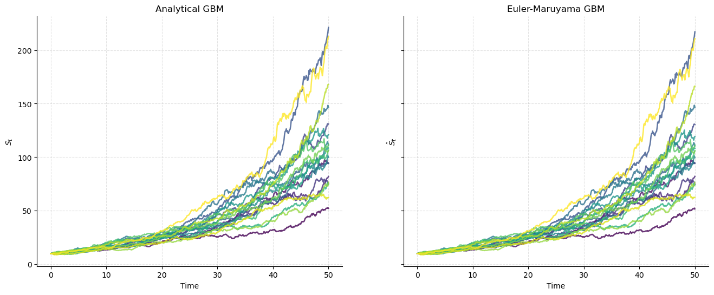
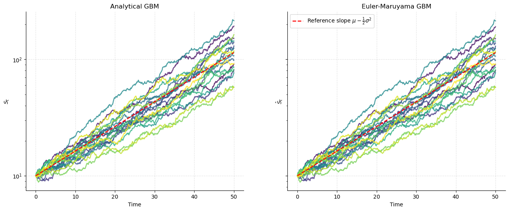
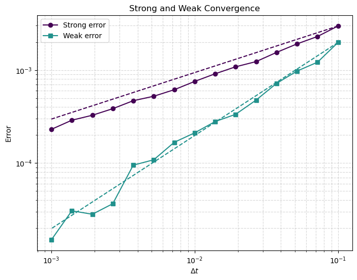
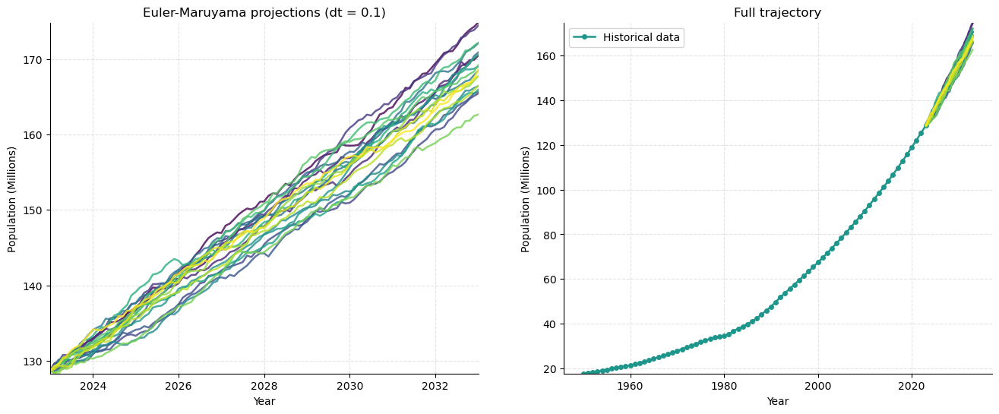
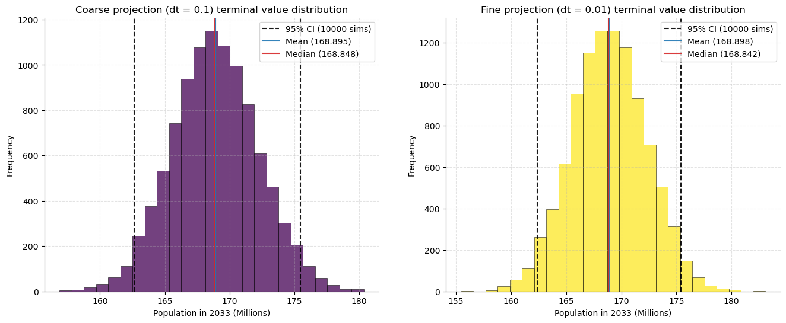

# Documentation

## The Geometric Brownian Motion SDE

In the context of stochastic processes, Geometric Brownian Motion refers to a continuous-time stochastic process where the logarithm of the varying quantity follows a Wiener process with drift. A Weiner process is a stochastic process with mean $\mu=0$, variance $\sigma^2t$ and without memory. Thus, a stochastic process $S_t$ that follows Geometric Brownian Motion (GBM from now onwards) will satisfy

$$
dS_t=\mu S_t dt+ \sigma S_tdW_t
$$

where $\mu$ is the relative drift and $\sigma$ the relative volatility, both real constants. This process is useful in modelling, as it can portray both deterministic trends and unpredictable events simultaniously. The analytic solution for this SDE is

$$
S_t = S_0 \exp\left( \left(\mu - \frac{1}{2}\sigma^2 \right)t + \sigma W_t \right)
$$

In order to validate this result, Itô's lemma is used.

### Itô's Lemma

Let $f(t,x)$ be a twice differentiable function of real variables $t,x$ and a stochastic process given by $dY_t=\mu_t dt+\sigma_t dW_t$. Then,

$$
df(t,Y_t)=\left(\frac{\partial f}{\partial t}+\mu_t\frac{\partial f}{\partial x}+\frac{\sigma_t^2}{2}\frac{\partial^2 f}{\partial x^2}\right)dt + \sigma_t\frac{\partial f}{\partial x}dW_t
$$

### Verification

By taking $f(t,x)=S_0\exp\left(\left( \mu-\frac12\sigma^2\right)t+\sigma x\right)$, it follows that $S_t=f(t,W_t)$.
Applying Itô's lemma with $Y_t=W_t$, it can be seen that $\mu_t=0,\sigma_t=1$, thus

$$
dS_t=df(t, X_t)=\left(\mu-\frac12\sigma^2 + \frac{\sigma^2}2\right)S_tdt + \sigma dW_tS_t \implies dS_t=\mu S_tdt + \sigma S_tdW_t\quad\blacksquare
$$

## Discretization

By taking the SDE, given by $dS_t=\mu S_t dt+ \sigma S_tdW_t$ and integrating in respect to time, it can be seen that

$$
\int_t^{t+\Delta t}dS_u= S_{t+\Delta t}-S_t=\int_t^{t+\Delta t}\mu S_u du+ \int_t^{t+\Delta u}\sigma S_udW_u
$$

The first integral in the right hand side can be aproximated, for sufficienly small $\Delta t$, using the integral mean value theorem as $\int_t^{t+\Delta t}\mu S_u du\approx\mu S_t\Delta t$. This is essentially the left endpoint rectangle rule for integrals. Similarly, over a small $\Delta t$, $S_u\approx S_t$. Thus,

$$
\int_t^{t+\Delta u}\sigma S_udW_u\approx \sigma S_t\int_t^{t+\Delta u}dW_u=\sigma S_t(W_{t+\Delta t}-W_t)=\sigma S_t \Delta W_t
$$

Thus, the SDE can be discretized as

$$
S_{t+\Delta t}\approx S_t + \mu S_t\Delta t + \sigma S_t \Delta W_t
$$

Finally, due to the Brownian process $W_t$ being, by definition, independent, it follows that
$$
\Delta W_t=W_{t+\Delta t}-W_t\sim N(0,\Delta t) = \sqrt{\Delta t} \cdot N(0,1)
$$

By using this discretization, as well as the normal distribution for the Brownian increments, stochastic paths that satisfy the SDE can be numerically aproximated. Therefore, the solution for the SDE can be numerically simulated. This numerical method for aproximating SDE is known as the Euler-Maruyama method.

## Strong and weak convergence formulations

The next step is to formulate the convergence criterions that will be used to test the discretization found previously. The two standard convergence criterions are strong and weak convergence.

Let $S_t$ be the closed form analytical solution for the GBM SDE, and $\hat S_t$ a numerical aproximation using the Euler-Maruyama method. The strong error refers to the difference between the exact and aproximated paths and is calculated as $\mathbb E[|S_t-\hat S_t|]$. The strong convergence theorem for the Euler-Maruyama method (proof is omitted), states that

$$
\mathbb E[|S_t-\hat S_t|] \le C \Delta t^{1/2},\quad C\in\mathbb R
$$

Therefore, the method is said to have strong order 0.5.

On the other hand, let $f$ be a sufficiently smooth test function, the weak error refers to the difference between the expectations for $f(S_t)$ and $f(\hat S_t)$. This compares not the difference between paths, but rather the difference between functions of those paths. For the Euler-Maruyama method (proof is omitted), weak convergence is given by

$$
|\mathbb E[f(S_t)]-\mathbb E[f(\hat S_t)] \le C \Delta t,\quad C\in\mathbb R
$$

Therefore, the method is said to have weak order 1.

For applications that rely on expectations (stock pricing, population estimations), the concerning error will generally be the weak one, as test functions (expectations, moments, variances) will be governed by this higher order error. However, when properties of the paths are the object, such as the maximum value achieved, the concerning error estimation for the method will be the strong convergence order, which decreases more slowly.

### Intuition behind the convergence orders

Intuitiely, the weak order can be seen to be 1, because the linear discretization of the $\mu S_t dt$ term has an error of size $h$, as does the Euler method for aproximating regular ODEs. Also, as the Weiner process has mean 0, those terms cancel for expectations, making the method be linear (order 1) for weak error.

During the discretization, the Weiner term inside $S_t$ is taken to be constant, but it would continuously vary with standard deviation $h^{\frac{1}{2}}$. Also, the differential element will also have a size of order $h^{\frac{1}{2}}$. Thus, the local pathwise error will be of order $\mathcal O(h)$. There number of timesteps will be of order $N\sim \frac{1}{h}$. However, due to the errors having random sign, they will acumulate as a random walk (as $\sqrt N$), so the global strong error will be of order $\mathcal O(\sqrt N h)=\mathcal O\left(\sqrt{\frac{1}{h}}h\right) = \mathcal O(h^{\frac{1}{2}})$.

## Numerical validation

Once the theoretical framework is set up, the method can be implemented, and its convergence numerically tested. The closed form and Euler-Maryama method are implemented in a function each in the [Convergence_Test](../src/sde_analysis/Convergence_Test.ipynb) Jupyter notebook. The code directly mirrors the math shown above, and allows for the calculation of paths using the same normal samples for both, so the error estimations are correctly calculated. As with most numerical methods, both solutions are visually indistinguishable, except for really high volatilities, where the numerical error can be sometimes appreciated. Here, 20 realizations with a 0.1 time increment and 5% both growth and volatility are shown.

Also, by plotting log-returns, the non-disturbed growth rate of $\mu-\frac12\sigma$ can be qualitatively evaluated. Using the same parameters as before, the results are the following

Finally, both weak and strong errors can be calculated using the dedicated functions. The reference lines for slopes 1 and 0.5 are also shown. For 1000 simlations, at increasingly smaller $\Delta t$ and 5% growth and volatility, the results are the following

Therefore the results (for this test function and parameter values) verify the theorem, as the assymptotic convergence rates of the method are the expected.

## Application to modelling

Due to various real world phenomenons being modellable as a constant drift with random fluctiations, the GBM SDE can be useful for predictions. In this case, it will be used to model population growth under uncertainty. The full code is in the [Modelling_test](../src/sde_analysis/Convergence_Test.ipynb) Jupyter notebook.

However, it must be noted that this is a simple model, which has various assumptions that greatly limit its scope. Firstly, population growth is generally modelled as logistic, as it cannot grow unbounded, whereas this model is exponential. Also, volatility is taken as relative, so bigger populations have linearly bigger random fluctuations. Finally, growth rate is taken to be constant, which isn't generally true over long periods of time in human history.

In order for this model to provide reasonable results, it will be applied to historical population data (1950 to 2023) of the country of Ethiopia, which has shown a clearly exponential trend, and predictions will only be extrapolated 10 years, as longer timespans would likely be subject to the slowdown of logistic population growth. The data is obtained off the UN World Population Prospects (2024), processed by "Our World in Data".

In order to model from the real world data, estimations for mean and volatility must be found. By taking, the analytical solution found previously and applying some algebraic manipulation, it can be found that

$$
R_t=\ln\left(\frac{S_{t+\Delta t}}{S_t}\right) = \left(\mu-\frac{1}{2}\sigma^2\right) \Delta t+ \sigma \Delta W_t
$$

Due to the Brownian process being independent, $\Delta W_t\sim N(0,\Delta t)$. The data used is equally spaced in years, so by using years as our units, the sample mean of $R$ will be $\left(\mu-\frac{1}{2}\sigma^2\right)\Delta t=\left(\mu-\frac{1}{2}\sigma^2\right)$ and its variance will be $\sigma^2\Delta t=\sigma^2$.

The observed data fits to a 2.72% annual growth and a 0.63% annual volatility. Taking these parameters, paths can be simulated. Simulating 20 paths extrapolated 10 years with 0.1 year timesteps, the paths are the following.

If many more paths are simulated ($10^4$ in this case), histograms for the population at terminal time (2033) can be seen. Also, the mean population, as well as the 95% CI can be found. Two different timesteps are used to see the effect it has.

Using these parameters, the results are the following

| Method |       Mean       |             95% CI          |
|--------|------------------|-----------------------------|
| Coarse | 168.895 millions | [162.635, 175.449] millions |
| Fine   | 168.898 millions | [162.382, 175.431] millions |

The forecasted data has a wide confidence interval of 13 million inhabitants, but instead of fitting noisy data to a deterministic model (such as an exponential fit), and treating those deviations as errors, it fits noisy data to a model that accounts for that noise. Therefore, it provides comprehensive results (in the form of histograms for example), that account for the random aspect of the governing process, instead of trying to fit the data into a deterministic model.
